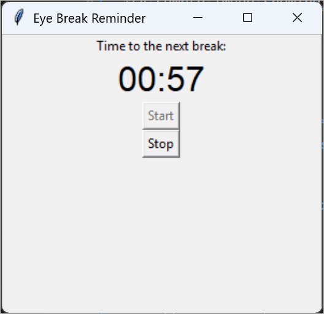

# Eye Break Reminder

A simple desktop application built with Python and Tkinter to remind you to take regular breaks from your screen, helping to reduce eye strain. The application runs a countdown timer and displays a notification when it's time to rest your eyes.




## Features

-   **Simple Interface**: A clean and straightforward user interface.
-   **Countdown Timer**: Visually displays the time remaining until your next break in `MM:SS` format.
-   **Start/Stop Control**: Easily start and stop the timer at any time.
-   **Break Notifications**: A pop-up message box alerts you when it's time for a break.
-   **Automatic Cycle**: After the break is over, the timer for the next work session starts automatically.
-   **Customizable Durations**: Easily change the work and break durations by modifying variables in the code.

## How It Works

The application operates on a simple work-break cycle:

1.  **Work Session**: You start a work timer, which counts down from a predefined duration (default is 3 minutes).
2.  **Break Time**: When the timer reaches zero, a message box appears, telling you to take a break.
3.  **Break Session**: The application pauses for the break duration (default is 9 seconds).
4.  **Restart**: After the break, the work timer automatically resets and starts the countdown for the next session.

You can manually stop the timer at any point using the "Stop" button and restart it with the "Start" button.

## Prerequisites

-   **Python 3**: The script is written for Python 3.
-   **Tkinter**: This is the standard GUI library for Python and is included with most Python installations. No external libraries are needed.

## How to Run the Application

1.  **Save the Code**: Save the code into a file named `eye_break_app.py` (or any other `.py` name).

2.  **Open a Terminal**: Open a terminal or command prompt.

3.  **Navigate to the Directory**: Use the `cd` command to navigate to the folder where you saved the file.
    ```bash
    cd path/to/your/folder
    ```

4.  **Run the Script**: Execute the script using Python.
    ```bash
    python eye_break_app.py
    ```

The application window will appear, and you can click "Start" to begin the timer.

## Customization

You can easily customize the duration of the work and break periods by changing the values in the `__init__` method of the `EyeBreakApp` class.

Open the `eye_break_app.py` file and find these lines:

```python
class EyeBreakApp:
    def __init__(self, master):
        # ... (other code)

        self.work_duration = 180  # 3 minutes in seconds
        self.break_duration = 9  # 9 seconds

        # ... (other code)
```

-   **To change the work duration**: Modify the value of `self.work_duration`. The value is in seconds. For example, for a 20-minute work session, set it to `1200`.
    ```python
    self.work_duration = 1200  # 20 minutes
    ```

-   **To change the break duration**: Modify the value of `self.break_duration`. For example, for a 20-second break, set it to `20`.
    ```python
    self.break_duration = 20  # 20 seconds
    ```

## License

This project is open-source and available under the [MIT License](LICENSE.md).